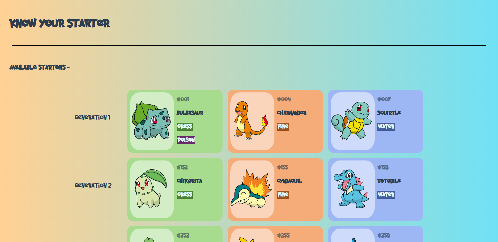

# know-your-starter(KYS)

Are you passionate about Pokemon as a series or a game franchise ?

Are you a _Pokefan_ or _Pokemon Connoisseur (if you know what I mean :thinking:)_, or maybe you aspire to become one ?

Then, **KYS** or **_know-your-starter_** can help you in getting your type basics right, as well as better understand about most important partners throughout your Pokemon journey !

Well, You guessed it, I'm talking about your starter pokemon. And you might find it very intriguing to know what hidden abilities your starter may possess, and how well him/her can perform against other type matchups.

## Introduction

_**[KYS](https://know-your-starter.netlify.app/)**_ is a simple web app which can provide you with essential info about your starter pokemon. Their types, abilities, base stats, and type effectiveness.

_KYS_ is essentially a JavaScript app that fetches data from [PokeAPI's](https://pokeapi.co/) servers and loads that data onto the User Interface designed in it's frontend.

_**Note** - KYS doesn't fetch images from PokeAPI(they have been just downloaded from there and get locally cached it on client side), because even though it was just starter pokemons, it created a disturbing amount of fetch API calls._

_**Update**- The amount of network calls KYS made due to the use of PNGs in it's previous versions, was far away from something performant, so now more than 60% of the images in KYS are now being implemented as **inline SVGs**._

_**Please Note**- If possible, try to open KYS on 1920x1080 resolution, since it's not responsive enough to stay intact on devices of smaller widths especially mobile ones. Just a gentle request from my side. PS - I will be working on a responsive one in the near future._
